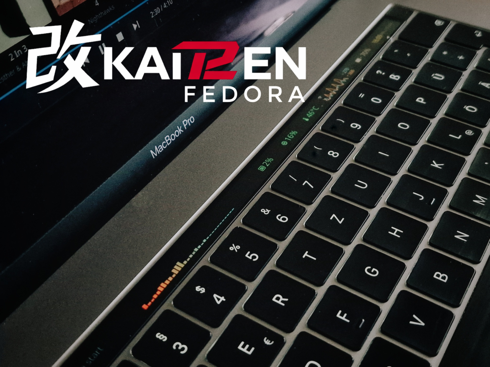

<p align="center">
  
</p>

# KAIT2EN Fedora

KAIT2EN brings cutting edge T2 Mac support to stock Fedora using DKMS modules and installer integration.
It does not use a modified kernel. You will receive kernel updates directly from Fedora.

[Install](#quick-start) |
[Docs](https://kait2en.github.io/KaiT2en-Fedora/) |
[Before You Install](#before-you-install) |
[Problematic Macs](#problematic-macs) |
[Features](#features) |
[Community](#community) |
[Contributing](#contributing)

## Quick Start

For a clean automatic install, boot macOS, connect an empty USB drive and run:

```bash
curl -fsSL https://github.com/kaiT2en/KaiT2en-Fedora/releases/latest/download/install-kait2en-fedora.sh | bash
```

Read the [automatic installation howto](https://kait2en.github.io/KaiT2en-Fedora/howto/installation/automatic/) before
you start. For all installation paths, start with the
[installation introduction](https://kait2en.github.io/KaiT2en-Fedora/howto/introduction/).

Useful paths:

- [Automatic installation](https://kait2en.github.io/KaiT2en-Fedora/howto/installation/automatic/)
- [Manual installation](https://kait2en.github.io/KaiT2en-Fedora/howto/installation/manual/00-get-broadcom-firmware/)
- [Revert T2 Linux Fedora to vanilla Fedora + KAIT2EN](https://kait2en.github.io/KaiT2en-Fedora/howto/migration/revert-t2linux-fedora/)
- [Updating KAIT2EN](https://kait2en.github.io/KaiT2en-Fedora/howto/postinstall/updating/)

## Before You Install

KAIT2EN is for Fedora on Intel T2 Macs. It can be installed on top of stock
Fedora, or used to move an existing T2 Linux Fedora installation back to vanilla
Fedora with KAIT2EN on top.

Keep macOS installed. It is the clean source for Apple firmware, can recover
T2/bridgeOS hardware states, and is the only place where bridgeOS panic logs are
available.

KAIT2EN does not support other distributions. The project uses Fedora as a
clean base for debugging, testing and upstream-oriented driver work.

## Problematic Macs

Most T2 Macs should work well enough for daily use. Some machines still have
low-level hardware issues and are mostly GPU-related. These issues are not 
KAIT2EN exclusive. It's just the current state of development.

- MacBook Pro A1990 15,1: resume is broken when running with the dGPU as primary
  GPU. See the [GPU configuration guide](https://kait2en.github.io/KaiT2en-Fedora/howto/postinstall/configuring-gpus/).
- Mac Pro 7,1: needs the Infinity Fabric Link jumpered and Wi-Fi is not working.
- iMac 27" 5K: only displays 4K.
- iMac 20" and 27": sporadic GPU initialization issues such as black screens on
  boot.

## Features

KAIT2EN comes with some real quality-of-life improvements. With react-drm we
have an awesome TouchBar demon. We have GUI apps to control the fan with curves,
adjust the battery charging limit, read SMC sensors and we also support DSP audio
on some Macbooks. The core module that speaks to the T2 is brand new: `t2bce`.
It makes suspend work and audio stutter-free.

- auto install with keyboard/trackpad support
- `t2bce` replaces apple-bce. It is split into separate modules for core, VHCI,
  DMA and audio.
- Working suspend out of the box for most T2 Macs, including Touch Bar after
  resume.
- `react-drm` replaces tiny-dfr with content-aware Touch Bar controls.
- `t2-fan-control` replaces t2fan-rd with a GUI for temperature and fan curves.
- `t2bce_audio` replaces `aaudio` with stutter-free audio and
  upstream-friendly UCM support.
- A fork of `apple-t2-audio-dsp` for supported Macs.
  See [supported devices](https://kait2en.github.io/KaiT2en-Fedora/howto/installation/manual/03-install-kait2en-modules-and-apps/#apple-t2-audio-dsp).
- `t2smc` replaces `applesmc` and adds RTC, hwmon, SMC sensor and battery charge
  limit support.
- `t2-smc-control` provides a GUI for battery charge limits, RTC inspection and
  live SMC sensor data.
- Fixes for broken ACPI tables that show as `AE_AML_BUFFER_LIMIT` and
  `AE_ALREADY_EXISTS` in the journal.
- Vanilla Fedora kernels by design.

## Project Philosophy

KAIT2EN [ˈkaɪ̯zɛn] refers to the Japanese philosophy of "kaizen": constant small
improvements.

The project exists to make T2 Macs work on stock Fedora while keeping driver
development close to upstream Linux. Out-of-tree DKMS modules give users fast
updates and give developers quick feedback without hours of rebuilding custom kernels.

Pre-patched distributions serve a purpose, but multiple custom kernel flavors
can hide bugs behind distribution-specific workarounds. KAIT2EN keeps the base
as conventional as possible so regressions are easier to isolate and fixes can
move toward mainline Linux.

## Community

Join the KAIT2EN community on [Discord](https://discord.gg/AGfjRk4ydj) or on
[Matrix](https://matrix.to/#/%23kait2en:matrix.org).

## Contributing

Contributions are welcome, especially when they move KAIT2EN fixes closer to
clean upstream Linux support.

Please keep changes and PR descriptions focused. You may use AI for debugging,
but we will notice slop and refuse to review or merge obvious slop. We are not
interested in workarounds. There is a distinct difference between making broken
things work and fixing things.

### Remaining Work

We still use some workarounds to make things work. In the long term, these
should be replaced with real fixes that can be upstreamed.

- `t2bce` needs code review and comments documenting T2-specific behavior.
- We need an OSDW quirk in upstream ACPI/Thunderbolt drivers to get away from
  the `!Darwin` kernel parameter.
- MacBook Pro 15,1 needs gmux, vgaswitcheroo, amdgpu and maybe i915 work so the
  SMU survives suspend.
- Mac Pro 7,1 has an unresolved Infinity Fabric Link issue.
- iMac GPU initialization and 5K support remain unclear.
- Broadcom 4377 chips need a brcmfmac fix for D0 to D3cold transitions.
- Apple Broadcom chips should ideally work without macOS firmware.
- bridgeOS logs from T2 without macOS would help debugging.
- AVE support needs reverse engineering.
- Fingerprint support needs reverse engineering.

## License

KAIT2EN-owned scripts, howto documents, project text and helper code are MIT
licensed.

Kernel modules, apps and third-party tools may include code with different
origins. Those components keep their own licenses in their directories.
