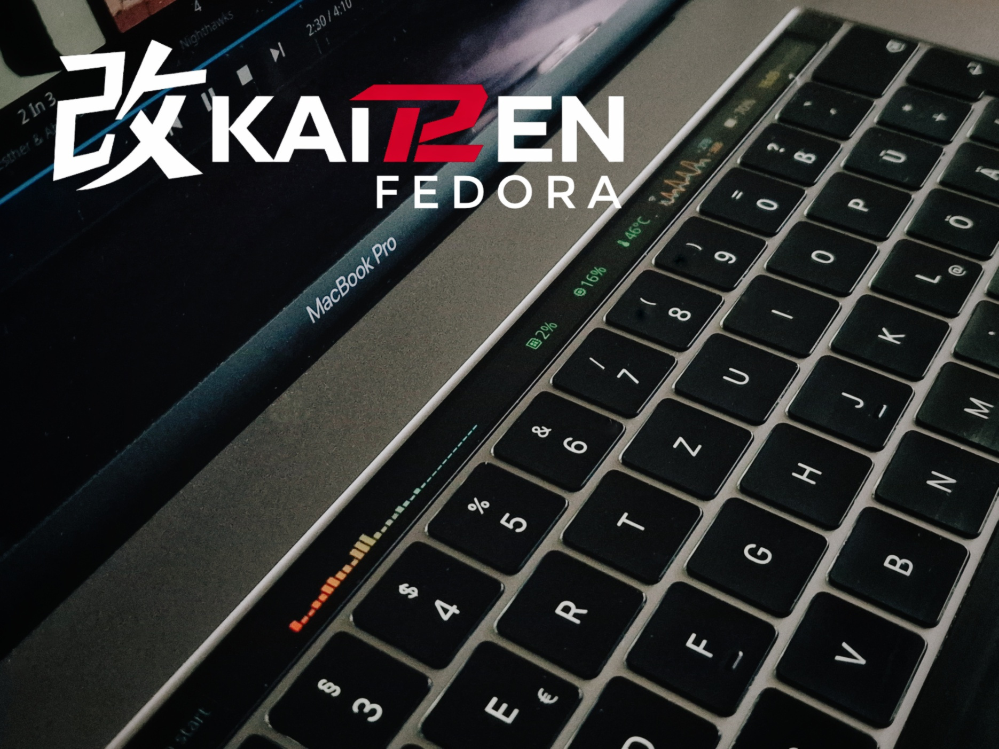

  

# KAIT2EN Fedora

KAIT2EN brings cutting edge T2 Mac support to stock Fedora using DKMS modules.
You will receive kernel updates directly from Fedora and the latest T2 modules from us.

[Docs](https://kait2en.org/documentation.html) |
[Blog](https://kait2en.org/blog.html) |
[Community](#community) |
[Contributing](#contributing)

## Install

Follow the [installation guide](https://kait2en.org/documentation.html#installation).

## Community

Join the KAIT2EN community on [Discord](https://discord.gg/AGfjRk4ydj) or on
[Matrix](https://matrix.to/#/%23kait2en:matrix.org).

## Contributing

Contributions are welcome, especially when they move KAIT2EN fixes closer to
clean upstream Linux support.

Please keep changes and PR descriptions focused.
**We will reject PRs and Issues when we notice we are talking to AI!**
At least talk to us in person.
We are not interested in workarounds.
We are not interested in major AI refactories.
There is a distinct difference between making broken things work and fixing things.

## License

KAIT2EN-owned scripts, howto documents, project text and helper code are MIT
licensed.

Kernel modules, apps and third-party tools may include code with different
origins. Those components keep their own licenses in their directories.

The kernel modules are GPL-2.0. The KAIT2EN userspace (apps and audio DSP
profiles) is not open source: it carries the KAIT2EN License 1.0, which allows
use with KAIT2EN on your own Mac and excludes named parties. The full breakdown
is in [LICENSING.md](LICENSING.md).

The code licenses do not grant the KAIT2EN name or logo. Their use, and what
the project stands for, are described in [TRADEMARK.md](TRADEMARK.md) and
[VALUES.md](VALUES.md).
